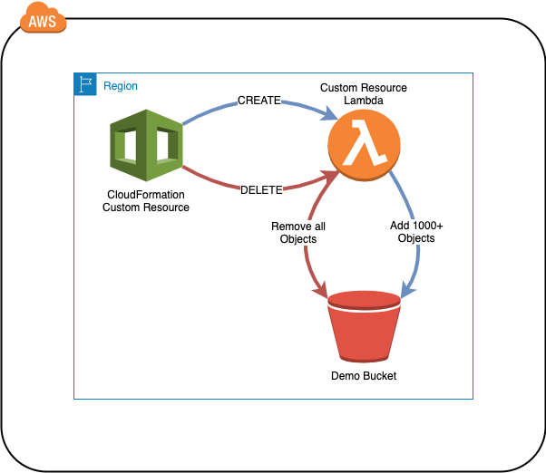

# AWS CloudFormation Custom Resource Starter Template

This template is used to create a CloudFormation Stack that implements a single Custom Resource.
The custom resource's primary purpose is to remove objects from an S3 bucket before the bucket can be deleted during a CloudFormation stack tear down.




Upon successful deployment or update, the bucket will be populated (or repopulated) with over 1000 small objects (files).
There is nothing special about each file, and the construction of files can be observed in the associated [Lambda function](./templates/functions/empty_bucket/empty_bucket.py) in this repo.

<br />

## Getting Started
---
At a minimum, access to an AWS Account and permissions to deploy all of the resources defined in the template from the CloudFormation console are required.  If you would like to deploy the template from the commandline a set of CLI credentials with the permissions to deploy all of the resources defined in the template and the installation and configuration of AWS CLI is required.

<br />

## Prerequisites
---
* Installing AWS CLI: https://docs.aws.amazon.com/cli/latest/userguide/cli-chap-install.html
* Configuring AWS CLI: https://docs.aws.amazon.com/cli/latest/userguide/cli-chap-configure.html

This project utilizes [CRHelper](https://pypi.org/project/crhelper/), which, by their own description will:
> Simplify best practice Custom Resource creation, sending responses to CloudFormation and providing exception, timeout trapping, and detailed configurable logging.

CRHelper is part of the package dependencies located in the Lambda Layer dependencies.

<br />

## Deploying via AWS CLI
---
Create the tags.json file and populate with all necessary tags.

*Example*:
```
[
    "Business_Unit=1Strategy",
    "Owner=John Doe",
    "Project=Bastion Host"
]
```
Package the template locally (stores lambda artifacts in S3):
```
aws cloudformation package \
    --template-file templates/template.yaml \
    --s3-bucket "my-artifacts-bucket" \
    --output-template-file deploy/deploy.yaml
```

Deploy the template to your account/environment:
```
aws cloudformation deploy \
    --template-file deploy/deploy.yaml \
    --stack-name s3-custom-resource-starter \
    --capabilities CAPABILITY_IAM \
    --tags file://tags.json
```

<br />

## Authors
---
* Scott Schmidt @sjschmidt44 - [1Strategy](https://www.1strategy.com)

<br />

## License
---
Copyright 2019 1Strategy

Licensed under the Apache License, Version 2.0 (the "License"); you may not use this file except in compliance with the License. You may obtain a copy of the License at

http://www.apache.org/licenses/LICENSE-2.0

Unless required by applicable law or agreed to in writing, software distributed under the License is distributed on an "AS IS" BASIS, WITHOUT WARRANTIES OR CONDITIONS OF ANY KIND, either express or implied. See the License for the specific language governing permissions and limitations under the License.

<br />

## References
---
* AWS S3 Developer's Guide: https://docs.aws.amazon.com/AmazonS3/latest/dev/Welcome.html
* CloudFormation Best Practices: https://docs.aws.amazon.com/AWSCloudFormation/latest/UserGuide/best-practices.html
